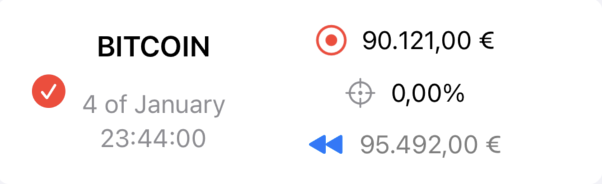
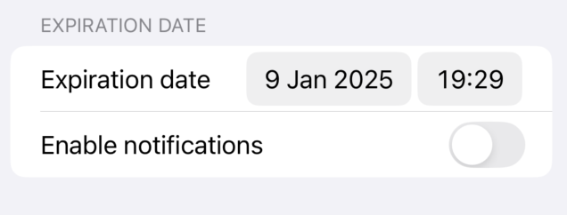
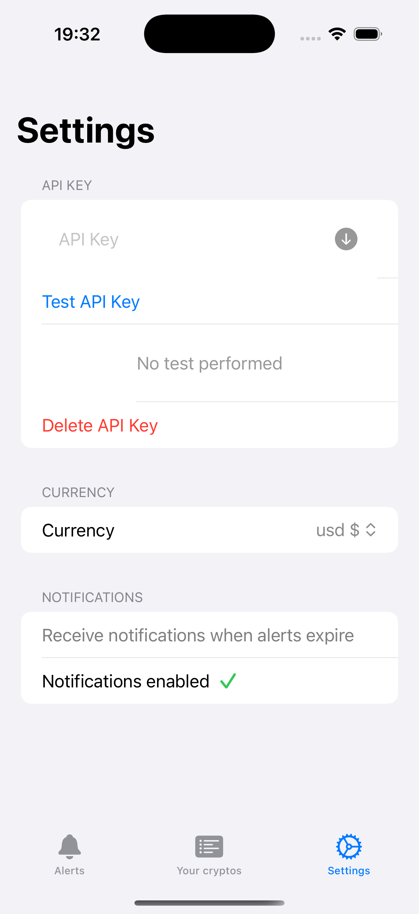
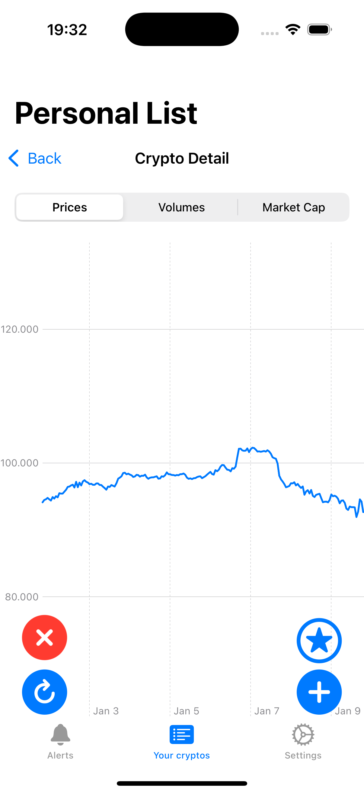

# CryptoTracker
## Funcionalidades destacadas
### Alertas
- Se pueden configurar alertas para monitorear el precio de una criptomoneda.
- Hay dos tipos de alertas: `Precio` y `Volatilidad`.
  - `Precio` se activará cuando el precio de la criptomoneda alcance un valor determinado.
  - `Volatilidad` se activará cuando el precio de la criptomoneda cambie en un porcentaje determinado.
- La alerta, una vez creada, mostrará
  - `precio actual de la criptomoneda` ⭕️
  - `target (precio o volatilidad)` 🎯
  - `precio cuando se estableció la alerta` ⏰
  
- La alerta tiene 3 posibles estados:
  - `Objetivo alcanzado` 🟢
  - `Expirada` 🔴
  - `Activa` 🔵
### Notificaciones
- Opción para la recepción de notificaciones al configurar una alerta.
  
- Se recibirá una notificación cuando la alerta expire.
### API Key
- Es recomendable configurar una API Key para evitar el límite de peticiones a la API pública de CoinGecko.
- La API Key se guarda de forma segura en Apple Keychain.
- Capacidad para comprobar la validez de la API Key en el apartado de ajustes de la aplicación.
  
### Gráficos
- Visualizaciones de gráficos de la evolución del precio de cualquier criptomoneda.
- Hay que especificar el rango de tiempo para la visualización del gráfico.
- Solo se pueden visualizar rangos de tiempo pasados.
  
